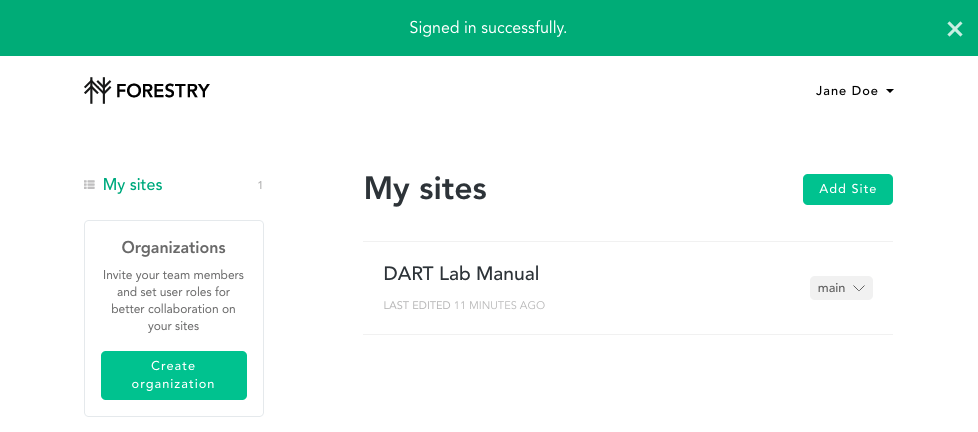
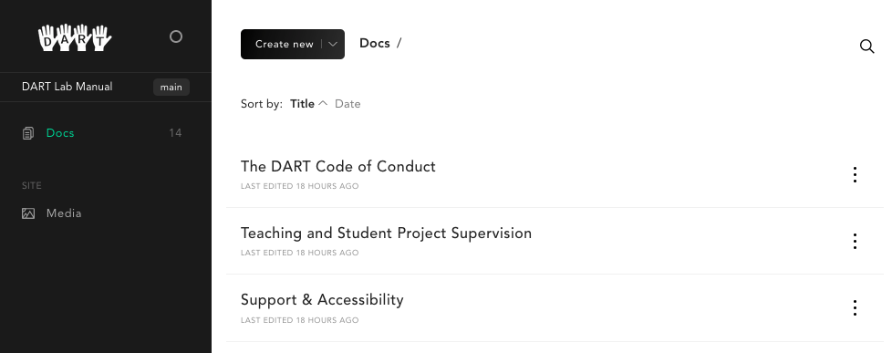

# Editing the Manual

## Get an Invite
If you haven't already, make sure to get an invite from the admin in order to
collaborate on the manual. This invite email will then link you to [forestry.io](https://forestry.io) to sign up or login. 

## Logging in to Forestry.io
The invite will automatically redirect you to the forestry.io login page. Or else you can navigate to [forestry.io](https://forestry.io/) and find the login/sign up tab in the nav bar along the top. 

*Forestry.io home page*

Once you have signed up or logged in, you will be confronted by your "dashboard" where the DART Lab Manual will be available for you to access. If it isn't visible, this is most likely because you haven't been added as a contributor. In this case, contact the admin and request an invite.

*Dashboard view*

## Viewing the Docs
Having clicked on the manual link on the dashboard page, you will now find yourself in the editing environment. This is the inner workings on the manual! Hopefully this won't look too intimidating :sweat_smile:. To view the current content of the manual click on the Docs heading in the sidebar. Here you will see a list of all the pages. 

*Docs view*

## Editing an Existing Document
To make an edit to an existing document, simply click on the desired document to enter into edit mode. This view should be familiar to you - it's simply at WYSIWYG (What You See Is What You Get) editor. Along the bottom is a toolbar to help you with basic word processing tasks: bolding and italicizing text, adding lists, adding images and links etc. 

Once you have edited the document you will have to click the save button in the top right of the page in order to persist the edits.

::: warning NOTE
Saved edits etc. will not immediately be mirrored on the DART manual site. This is normal - it usually takes between 2-5 minutes for changes to be displayed.
:::

## Creating a New Document
With the Docs heading selected in the sidebar and the document list displayed, you can select the "create a new document" from the "Create new" dropdown found at the top of the document list. 

You will now be greeted by the editor. Add a page title and the contents of your page as you would in any other word processor. 

::: warning NOTE
Make sure to add a title to the "title" field as not doing so will make it invisible in the DART manual sidebar.
:::

## Adding Images
In order to add images to a document you must first upload your desired image/images to the media library: 

- Navigate to the media library by selecting the "media" heading in the sidebar.
- Click "upload" in the top right of the view and select the desired media.
- Once uploaded the images should appear in the library. 

To add the images to the document:
- Navigate to the document you want to add an image to.
- Select the "insert image" icon from the toolbar and the bottom of the view.
- Open the media library or insert link URL if using a linked image.
- Select the image/images from the library and click add. 

## Adding Tables 
I wish this were a little easier but it has to be this way if you want lovely looking clean tables with none of the formatting idiosyncrasies of your peers distracting you!
::: warning NOTE
The best way to ensure success with tables is to use your favourite spreadsheet program to make the table and then save or export as a CSV file before continuing.
:::

To add a table: 
- Visit (https://www.tablesgenerator.com/markdown_tables)[Tables Generator] and select Markdown from the menubar at the top if not already selected.
- Either use the tools available to create your table **OR**
- Import your CSV table via the file dropdown menu
- make sure "line breaks as  " option box below the table is checked.